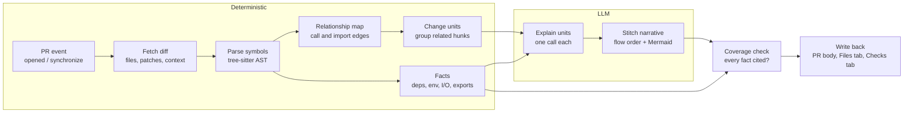
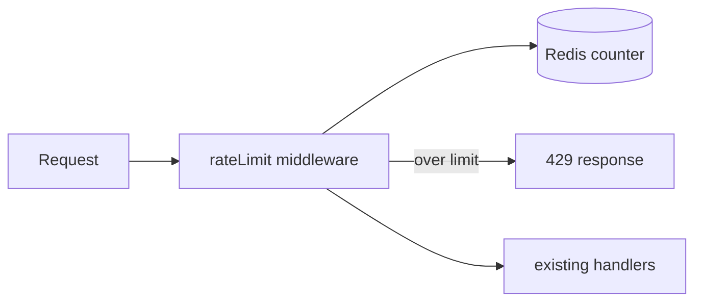

# Lazy PR Reviewer — Context, Plan & Implementation

_As of 2026-09-28_

## Context

Lazy PR Reviewer explains a pull request instead of judging it. It reads the diff, works out how the changed pieces connect, and writes a guided walkthrough so a reviewer understands the change before reading code.

It borrows its plumbing from tools like CodeRabbit but not its purpose. CodeRabbit hunts for bugs and leaves review comments. This tool narrates what changed, why each piece exists, and how data flows between them.

The aim is better review, not faster merges. AI-written PRs are large and unfamiliar, so it's tempting to skim and merge. The walkthrough sends the reviewer back to the code at every step and explains unfamiliar imports, types, and idioms. That way less experienced developers learn what the code does under the hood. The tool must not become a new thing to rubber-stamp: an explanation that replaces reading the code is worse than none.

### How GitHub integrations get PR access

| Mechanism | Identity | Best for |
| --- | --- | --- |
| GitHub App | `appname[bot]`, per-install scoped permissions | Multi-repo installs, distribution, chat replies |
| GitHub Action | `github-actions[bot]` via `GITHUB_TOKEN` | Fast MVP, no server to host |
| PAT / OAuth App | The human user | Personal scripts only |

A GitHub App works in four steps:

1. **Install.** An org or user installs the app and grants scoped permissions (for example `pull_requests: write`, `contents: read`, `checks: write`).
2. **Webhook.** GitHub POSTs events such as `pull_request.opened` and `pull_request.synchronize` to the app server, signed with `X-Hub-Signature-256`.
3. **Token.** The app signs a JWT with its private key and exchanges it at `POST /app/installations/{id}/access_tokens` for an installation token that lasts 1 hour.
4. **API calls.** With that token the app reads diffs and files and writes back check runs, comments, or PR body edits.

## Goals and non-goals

**Goals**

- Explain what each change does in plain language.
- Show how changed pieces connect: callers, callees, data flow, config wiring.
- Order the walkthrough by execution flow (entry point, then logic, then data), not by file name.
- Include a diagram of the flow for any PR that touches more than one component.
- Push reviewers toward the code: every walkthrough step links to the exact diff lines, and each unit carries a "check yourself" question about a specific line.
- Teach as it explains: new imports and packages, new types, and language idioms get a short explanation.
- Keep facts separate from narrative: list what the diff objectively does (new dependencies, env reads, I/O, exports) using deterministic code, not the model.
- Regenerate on every push and replace the previous output rather than stacking new comments.

**Non-goals**

- Finding bugs, style issues, or security problems.
- Approving, requesting changes, or blocking merges.
- Suggesting code edits.

"Check yourself" questions don't break these non-goals. They point at a line and ask a question, and they never state an answer or a verdict.

## Architecture

The pipeline turns a raw diff into a flow-ordered explanation. Two ideas carry it:

- **Relationship map.** The model gets the diff plus how its pieces connect, not the diff alone.
- **Facts list.** The pipeline pulls out what the diff does without the model, so a PR can't talk its way out of it. Facts go straight to the output, and a coverage check lists any fact the narrative never cites.



Everything except the two LLM stages is deterministic code with no model calls. The model runs once per change unit (map) and then once to stitch the units together (reduce).

## Implementation

The stack is TypeScript on Node: Octokit for GitHub, web-tree-sitter for parsing, and the Anthropic SDK for the model. Each stage is its own module so the Action and the later App can share them.

| Module | Responsibility | Key calls |
| --- | --- | --- |
| `github/fetch.ts` | Load PR metadata, changed files, patches, and file contents at head and base | Action: `actions/checkout` with `fetch-depth: 0`, then `git diff base...head`. App: `GET /pulls/{n}`, `GET /pulls/{n}/files` (paginated), `GET /contents/{path}?ref={sha}` |
| `analysis/parse.ts` | Map each hunk to the symbols it touches (functions, classes, exports) | tree-sitter queries per language |
| `analysis/facts.ts` | Extract facts from added lines and manifests: new dependencies, env/config reads, network/fs/exec calls, new exports. Each fact gets an ID | Manifest diff (`package.json` etc.), regex in phase 1, tree-sitter queries from phase 2 |
| `analysis/graph.ts` | Build edges between changed symbols: calls, imports, config reads, type use | Reference search over head tree |
| `analysis/units.ts` | Group connected symbols into change units; topologically sort them by flow | Connected components + topo sort |
| `llm/explain.ts` | One model call per unit: what changed, role, inputs, outputs, facts cited, check-yourself questions, concepts | Messages API |
| `llm/stitch.ts` | Combine unit explanations into a summary, ordered walkthrough, and Mermaid diagram | Messages API |
| `output/coverage.ts` | List facts no unit cites; drop line references that aren't in the parsed patch | Pure function over facts + unit JSON |
| `github/publish.ts` | Write output and replace the previous run's output | `POST /check-runs`, `PATCH /pulls/{n}`, `POST /pulls/{n}/reviews`, `DELETE /pulls/comments/{id}` |

The Action reads a local checkout instead of the contents API. That gives it the full head tree for reference search and a local `git diff`. It also avoids the `/pulls/{n}/files` limits: 3000 files max, and `patch` is omitted on large files.

### Building context

1. For each hunk, find the smallest enclosing symbol in the head version of the file.
2. For each changed symbol, find its references in other changed files. Each hit becomes an edge.
3. Add unchanged symbols one hop away (direct callers and callees) as read-only context. This lets the model say "this is called from the existing `router.ts`".
4. Classify each unit by role (entry point, logic, data, config, test) using path and symbol heuristics. The role decides the walkthrough order.
5. Extract facts and attach each one to the unit that contains its line.

### Prompting

- The system prompt forbids judging or suggesting fixes. It asks only for what changed, why it is likely there, and how it connects.
- The diff, PR title, PR description, and code comments are untrusted data. The prompt wraps them in delimited tags and tells the model never to follow instructions found inside them.
- Each unit prompt includes its hunks, surrounding symbol bodies, its edges, its facts with IDs, and the PR title and description.
- The model returns structured JSON so the stitch step, coverage check, and diagram builder can rely on the fields:
  - `summary`, `role`, `connects_to[]`, `explanation`
  - `cites_facts[]`: fact IDs the explanation covers
  - `check_yourself[]`: `{ path, line, question }`. It must be an open question about a changed line, never an answer or a verdict
  - `concepts[]`: `{ name, explanation }` for new imports, new types, and idioms the diff introduces
- Skip concepts the repo already uses widely, for example an import already present in many files at base. This keeps output short on mature codebases.

### Review nudges

- Every walkthrough step and every check-yourself question links to its Files tab anchor: `https://github.com/{owner}/{repo}/pull/{n}/files#diff-{sha256(path)}R{line}`.
- Line references the model returns are checked against the parsed patch, and ones outside the diff are dropped.
- Facts that no unit cites appear at the top under "Not covered by the walkthrough", so gaps stay visible.
- "Connection not found" and "not explained" are shown prominently, not buried.

### Large PRs

- Map-reduce: explain units in parallel, then stitch from the unit summaries, not the raw diffs.
- Skip lockfiles, generated code, and vendored paths, and list them as "not explained". Dependency changes in lockfile-backed manifests still appear as facts.
- App only: if GitHub omits a file's `patch` (very large files), fetch both versions and diff locally. The Action already diffs locally.

### Updates

- Re-run on `pull_request.synchronize`.
- Check run: find the previous one by name and replace it.
- PR body: re-fetch the body right before `PATCH` and replace only the text between `<!-- lazy-pr-reviewer:start -->` and `<!-- lazy-pr-reviewer:end -->`. If the markers are missing, append. A small race with author edits remains; accept it.
- Files tab notes: delete the previous run's review comments (tagged with a hidden `<!-- lazy-pr-reviewer -->` marker), then post fresh ones.
- Cache unit explanations by hunk content hash so unchanged units cost nothing on re-run.
  - Action: `actions/cache` keys are immutable, so save under `lpr-{pr}-{head_sha}` and restore with prefix `lpr-{pr}-`.
  - App: a key-value store keyed by repo, PR, and hunk hash.

## Output design

Review happens in the Files tab, so the output meets the reviewer there. The PR description holds the summary and facts. The Checks tab holds the full walkthrough. The conversation tab stays clean.

| Surface | Content | API | Limit |
| --- | --- | --- | --- |
| PR description | 3-line summary, facts, Mermaid flow, inside marker comments | `PATCH /pulls/{n}` body | 65,536 chars in body |
| Files tab | Per-unit "how this connects" note and check-yourself question on the unit's key hunk | Review with `event: "COMMENT"` | Line must be inside a diff hunk |
| Checks tab | Full walkthrough, new concepts, not-explained list | Check run `output.summary` + `output.text` | 65,535 chars each |

Mermaid renders in PR bodies. Whether it renders in check run output is unverified. Test that before phase 3 relies on it, and otherwise link to the diagram in the PR body.

Example output:

````markdown
<!-- lazy-pr-reviewer:start -->
## What this PR does
Adds rate limiting to the public API.

## Facts (from the diff, not the model)
- New dependency: `ioredis` ^5.4.0
- New env/config read: `RATE_LIMIT_RPM` in config.ts
- New network client: `ioredis` imported in middleware/rateLimit.ts
- New export: `rateLimit` from middleware/rateLimit.ts

## Flow


## Walkthrough
1. **[middleware/rateLimit.ts](#)** (new, entry point)
   Counts requests per API key in Redis and rejects over the limit.
   Reads RATE_LIMIT_RPM from config.ts (step 3).
   > Check yourself: [line 18](#) — what happens to requests if Redis is unreachable?
2. **[app.ts](#)** (wiring)
   Registers the middleware before the router, so every route is covered.
   > Check yourself: [line 9](#) — are there routes registered above this line that skip the limit?
3. **[config.ts](#)** (config)
   Adds RATE_LIMIT_RPM with a default of 60.

<details><summary>New concepts</summary>

- **ioredis**: Redis client for Node. `INCR` atomically adds 1 to a key and returns the new value, so concurrent requests can't double-count.
- **Express middleware**: a function `(req, res, next)` that runs before route handlers. Calling `next()` passes the request on; sending a response stops it.

</details>

## Not explained
- package-lock.json (generated)
<!-- lazy-pr-reviewer:end -->
````

## Plan

Phase 1 proves the explanations are useful before any investment in parsing or hosting. Each phase ends at a gate that must pass before the next one starts.

| Phase | Scope | Gate to next phase |
| --- | --- | --- |
| 1. MVP Action | Action on PR events, diff-only explanation, regex facts, line links, check-yourself questions, new concepts, Checks tab output | Regression set: explanations match ground truth, and the planted-injection PR doesn't change the facts or fool the narrative |
| 2. Context | tree-sitter parsing, relationship map, flow-ordered units, AST facts, coverage check | Walkthrough order matches real flow on the regression set |
| 3. Polish | Mermaid flow diagram, PR body summary, Files tab notes, cache on re-push | Stable output across pushes, no stacked comments |
| 4. GitHub App | Webhook server, multi-repo installs, per-repo config file, fork PR support | — |

### Phase 1 tasks

- [ ] Workflow on `pull_request` with `permissions: checks: write, contents: read`
- [ ] `actions/checkout` with `fetch-depth: 0`; diff with `git diff base...head`; skip generated paths
- [ ] Skip with a notice when `ANTHROPIC_API_KEY` is unavailable (fork PRs)
- [ ] Regex facts from added lines and manifest diffs: dependencies, env reads, network/fs/exec calls, exports
- [ ] Single model call with the untrusted-input system prompt: summary, per-file explanation, check-yourself questions, new concepts
- [ ] Validate model line references against the patch and render them as Files tab links
- [ ] Publish as a check run named `Lazy PR Reviewer`
- [ ] Build an `eval/` regression set: 5 to 10 of your own merged PRs with hand-written ground-truth explanations, plus one PR with a planted prompt injection

## Risks and open questions

| Risk | Mitigation |
| --- | --- |
| Prompt injection via diff, description, or code comments makes the explanation misleading | Deterministic facts section the model can't alter, coverage check for uncited facts, untrusted-input framing in the system prompt, injection PR in the regression set |
| Reviewers trust the explanation instead of reading the code | Line-anchored steps, check-yourself questions, visible "not covered" and "not explained" gaps |
| Model invents intent ("this was added to fix X") | Label intent as "likely" and ground it in the PR title, description, and linked issue |
| Model cites lines that don't exist in the diff | Drop line references not found in the parsed patch |
| Fork PRs get no secrets under `pull_request`, so no API key, and a read-only `GITHUB_TOKEN` | Phase 1 skips fork PRs with a notice. Never check out fork code under `pull_request_target`. The App in phase 4 fixes this |
| Check runs created with `GITHUB_TOKEN` may appear under an unrelated workflow's check suite | Acceptable for the MVP; the App owns its own suite |
| Reference search misses dynamic calls (DI, reflection, string routes) | Fall back to import edges and let the model flag "connection not found" |
| PR body edit overwrites an author's concurrent edit | Re-fetch right before `PATCH`, touch only the marked section |
| Mermaid may not render in check run output | Test in phase 3; fall back to linking the PR body diagram |
| Token cost on large PRs | Map-reduce, skip generated files, cache units by hash |
| Inline notes fail with 422 when the line is outside a hunk | Anchor notes only on changed lines from the parsed patch |
| Private key or API key leaks | Store in Actions secrets or a secret manager, never in the repo |

### Open questions

- Which languages must phase 2 support first?
- Public repos with fork contributors, or private repos only?
- Which model tier balances cost and quality for unit calls vs the stitch call?
- Should "new concepts" be tunable per repo (off, collapsed, expanded) via the phase 4 config file?
